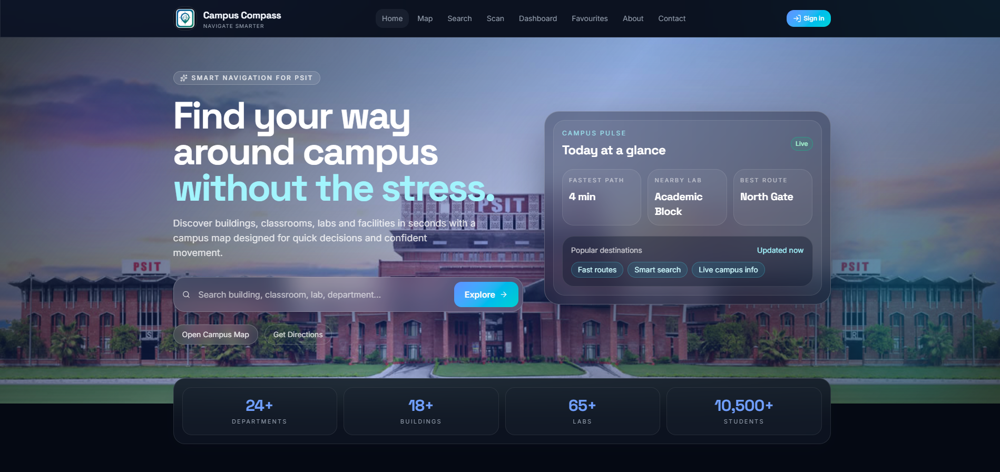
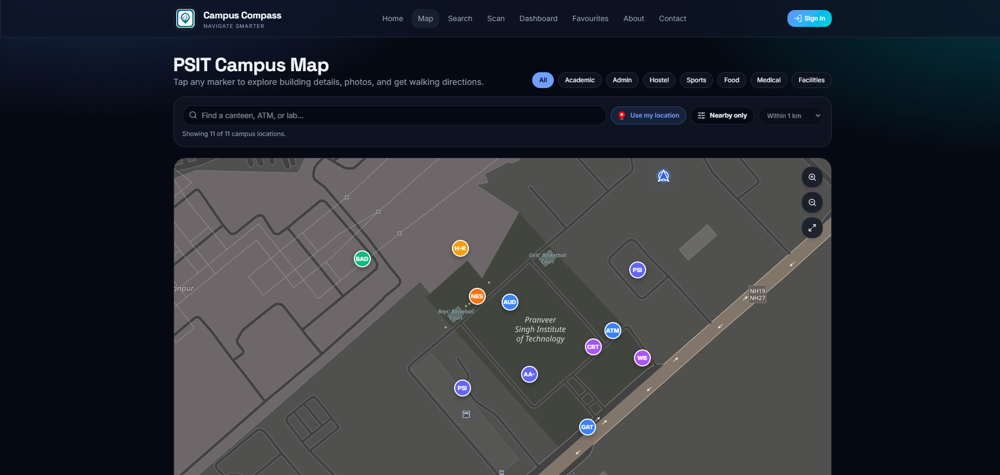
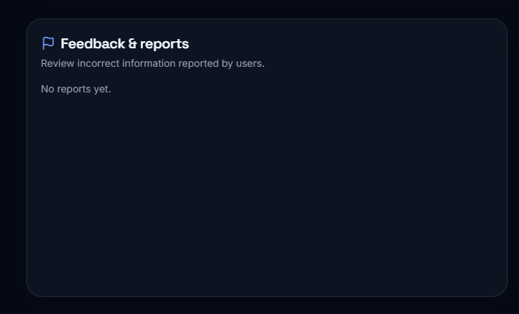
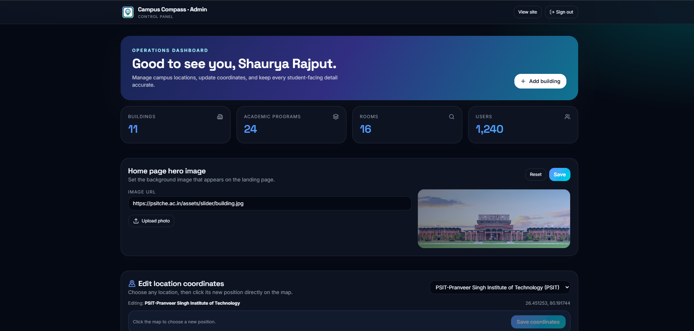

# 🧭 Campus Compass

### PSIT Campus Navigation & Discovery Platform

**Campus Compass** is a modern web application designed to make navigating the **PSIT campus** simple and interactive. Discover buildings and facilities, search for rooms and services, view your live location, save favourite places, and get walking directions across campus.

<p align="center">
  
</p>

<p align="center">
  <b>Explore • Search • Navigate • Discover</b>
</p>

---

## ✨ Features

### 🗺️ Interactive Campus Map

* Explore PSIT buildings and facilities
* Interactive building markers
* Building details and information
* Live user location
* Google Maps-style location marker
* Automatic location updates while moving

### 🚶 Navigation & Directions

* Search for buildings, rooms and services
* Plan walking routes
* OSRM-powered walking directions
* Route distance and estimated walking time
* Route insights for easier navigation

<p align="center">
  
</p>

### 🔍 Smart Search

Quickly find:

* Buildings
* Rooms
* Facilities
* Services
* Campus locations

### ⭐ Personalization

* Save favourite locations
* View recent routes
* Manage personal preferences

### 📱 QR & Voice Search

* QR code scanning for locations
* Optional voice-based search
* Quick access to building information

### 👤 Authentication

* User registration
* Login
* Password reset
* Google Sign-In
* Protected user features

### 📝 Feedback & Reports

Signed-in users can report campus issues and track their reports.

Users can view:

* Report history
* Report status
* Submitted building
* Problem type
* Message
* Timestamp

Supported report states:

`pending` · `approved` · `rejected` · `resolved`

<p align="center">
  
</p>

---

# 🛠️ Admin Portal

Campus Compass includes a dedicated admin dashboard available at:

```text
/admin
```

The admin portal provides tools for managing the campus platform.

### 🏢 Building Management

* Create buildings
* Update building information
* Delete buildings
* Upload building images
* Edit map coordinates
* Explicitly save coordinate changes

### 👥 User Management

* View registered users
* View user roles and account status
* Delete user accounts
* Reset user passwords

### 📊 Analytics

View platform and feedback analytics from the admin dashboard.

### 💬 Feedback Management

Admins can:

* Review user reports
* View reporter information
* Check building and problem type
* Update report status

### ⚙️ Site Settings

Manage:

* Contact information
* Social media links
* Homepage settings
* Hero/background images

<p align="center">
  
</p>

---

# 🧰 Tech Stack

## Frontend

* **React 19**
* **TanStack Start**
* **Vite**
* **Leaflet**
* **OpenStreetMap**
* **OSRM**
* Optional **MapTiler**
* Optional Google Sign-In

## Backend

* **Node.js**
* **Express.js**
* **MongoDB**
* JWT authentication

---

# 📁 Project Structure

```text
campus-compass/
│
├── frontend/
│   ├── src/
│   ├── public/
│   ├── package.json
│   └── ...
│
├── backend-reference/
│   ├── server.js
│   ├── routes/
│   ├── models/
│   ├── middleware/
│   ├── package.json
│   └── ...
│
├── docs/
│   └── screenshots/
│       ├── home.png
│       ├── map.png
│       ├── reports.png
│       └── admin-dashboard.png
│
├── netlify.toml
├── render.yaml
└── README.md
```

---

# 🚀 Getting Started

## Requirements

Make sure you have:

* Node.js **18+**
* npm
* MongoDB if running the backend locally

> Browser location permission is required for the public frontend. Use `localhost` during development or HTTPS in production because browser geolocation requires a secure context.

---

# 💻 Frontend Setup

Open a terminal:

```bash
cd frontend
npm install
npm run dev
```

The development server normally runs at:

```text
http://localhost:3000
```

### Useful commands

```bash
npm run dev
npm run build
npm run preview
npm run lint
```

---

## 🔐 Frontend Environment Variables

Create:

```text
frontend/.env
```

Example:

```env
VITE_API_URL=http://localhost:5000
VITE_GOOGLE_CLIENT_ID=your_google_client_id
VITE_MAPTILER_KEY=your_maptiler_key
```

### Environment variables

| Variable                | Required | Purpose                         |
| ----------------------- | -------- | ------------------------------- |
| `VITE_API_URL`          | Optional | Enables the Express backend API |
| `VITE_GOOGLE_CLIENT_ID` | Optional | Google Sign-In                  |
| `VITE_MAPTILER_KEY`     | Optional | MapTiler map tiles              |

If `VITE_API_URL` is not configured, the frontend runs in **demo mode** using local mock data.

Demo-mode data such as favourites, reports and site settings are stored locally in the browser.

---

# ⚙️ Backend Setup

Open another terminal:

```bash
cd backend-reference
npm install
```

Create the environment file:

```bash
copy .env.example .env
```

For macOS/Linux:

```bash
cp .env.example .env
```

Then configure:

```env
MONGO_URI=your_mongodb_connection_string
JWT_SECRET=your_jwt_secret
CLIENT_ORIGIN=http://localhost:3000
APP_URL=http://localhost:3000
GOOGLE_CLIENT_ID=your_google_client_id
```

Start the backend:

```bash
npm run dev
```

The API runs at:

```text
http://localhost:5000
```

For production-style execution:

```bash
npm start
```

---

# 🔌 API

## Authentication

```text
POST /api/auth/register
POST /api/auth/login
GET  /api/auth/me
```

## Buildings

```text
GET    /api/buildings
GET    /api/buildings/:id
POST   /api/buildings/:id
PUT    /api/buildings/:id
DELETE /api/buildings/:id
POST   /api/buildings/:id/image
```

> Building modification endpoints require admin access.

## Search

```text
GET /api/search?q=...
```

## Reports

```text
POST  /api/reports
GET   /api/reports/my
GET   /api/reports
PATCH /api/reports/:id
```

Authenticated users can create and view their reports. Admins can review and update reports.

## Settings

```text
GET /api/settings
PUT /api/settings
```

## Admin

```text
GET   /api/admin/users
PATCH /api/admin/users/:id
POST  /api/admin/users/:id/reset-password
GET   /api/admin/analytics
```

---

# 🌐 Deployment

## Frontend → Netlify

The frontend can be deployed to **Netlify**.

The repository includes:

```text
netlify.toml
```

Configure the following environment variable in Netlify:

```env
VITE_API_URL=https://your-render-api.onrender.com
```

For example:

```env
VITE_API_URL=https://campus-compass-o69z.onrender.com
```

After changing environment variables, redeploy the site.

---

## Backend → Render

The backend can be deployed to **Render**.

The repository includes:

```text
render.yaml
```

Alternatively, configure the Render service with:

```text
Root Directory:
backend-reference

Build Command:
npm install

Start Command:
npm start
```

Set the required environment variables in Render:

```env
MONGO_URI=your_mongodb_connection_string
JWT_SECRET=your_jwt_secret
CLIENT_ORIGIN=https://your-netlify-site.netlify.app
APP_URL=https://your-netlify-site.netlify.app
GOOGLE_CLIENT_ID=your_google_client_id
```

For production, make sure the frontend is served over **HTTPS** so browser location services work correctly.

---

# 🔑 Authentication

Campus Compass supports:

* Email/password authentication
* Password reset
* Google Sign-In
* Protected user features
* Admin authentication
* Email OTP password recovery for the admin portal

If Clerk authentication is enabled in your current version, keep the Clerk publishable key in the frontend environment and the secret key only on the backend.

**Never commit secret keys to GitHub.**

---

# 🎬 Screenshots

### 🏠 Home

<p align="center">
  
</p>

### 🗺️ Campus Navigation

<p align="center">
  
</p>

### 📍 Building Details

<p align="center">
  
</p>

### 📊 Admin Dashboard

<p align="center">
  
</p>

---

# 🎯 Demo Mode

Campus Compass can run without a backend.

When:

```env
VITE_API_URL
```

is not configured, the frontend automatically uses mock data.

This allows you to:

* Explore the campus map
* Test navigation
* Search locations
* Save favourites
* Test reports
* Preview admin functionality

For demo authentication, an email beginning with `admin`, such as:

```text
admin@psit.ac.in
```

opens the demo admin experience.

> Demo credentials and mock authentication should not be used for production.

---

# 📍 Geolocation

Campus Compass uses browser geolocation to display the user's live position.

Location permission is required before accessing the public frontend pages.

For development:

```text
http://localhost:3000
```

For production:

```text
https://your-domain.com
```

HTTPS is required for browser geolocation in production environments.

---

# 🧪 Development

Run frontend and backend separately:

### Terminal 1

```bash
cd frontend
npm install
npm run dev
```

### Terminal 2

```bash
cd backend-reference
npm install
npm run dev
```

Then open:

```text
http://localhost:3000
```

---

# 🤖 Optional AI Assistance

Campus Compass can optionally include AI-powered assistance for helping users discover campus information and services.

AI functionality is optional and can be enabled according to the project's configuration.

---

# 🔮 Future Improvements

Potential improvements include:

* 📱 Progressive Web App support
* 🧭 Indoor navigation
* 🚌 Campus shuttle tracking
* 🔔 Real-time campus notifications
* 🗺️ 3D campus map
* 📲 Mobile application
* 🤖 More advanced AI campus assistant
* 📊 Advanced admin analytics

---

# 👨‍💻 Project

**Campus Compass**
PSIT Campus Navigation & Discovery Platform

Built to make navigating and discovering the PSIT campus easier, faster and more interactive.

---

## ⭐ If you like this project

Give the repository a ⭐ and feel free to explore, improve and contribute to the project.
